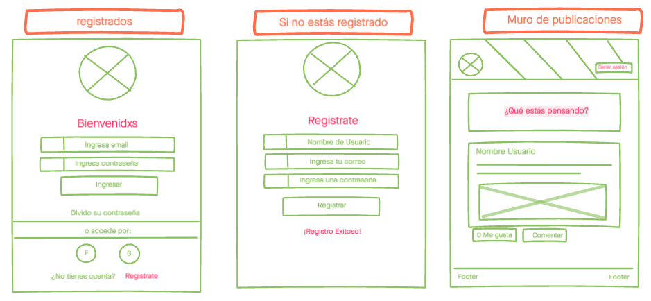
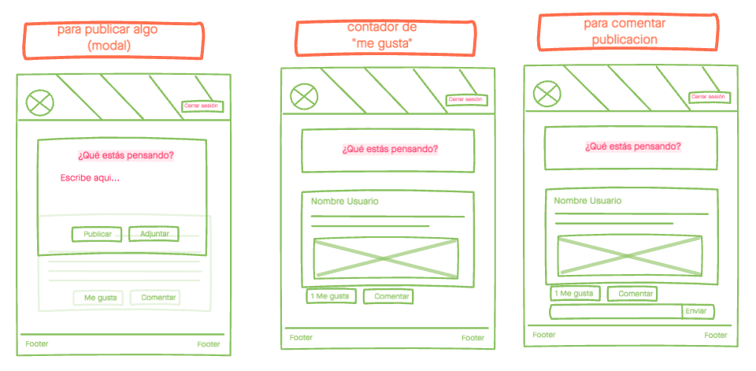
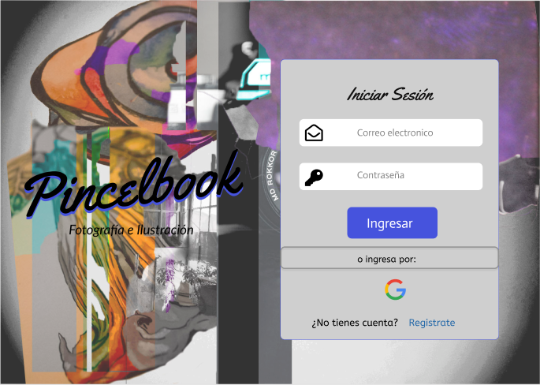
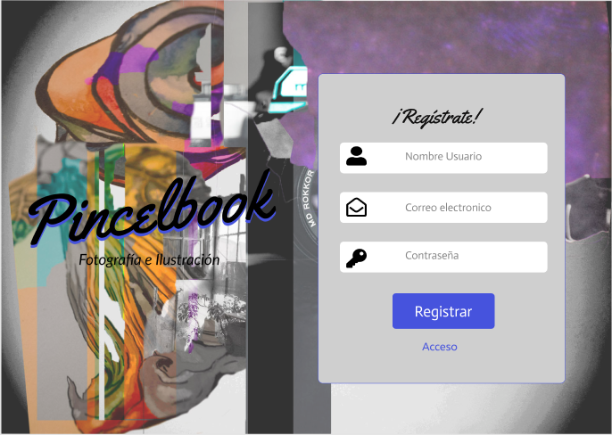
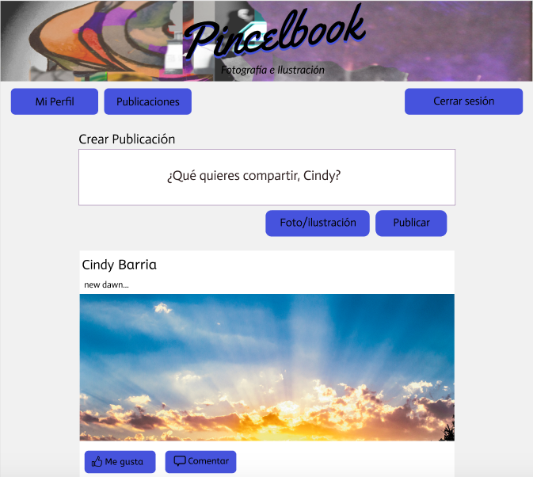
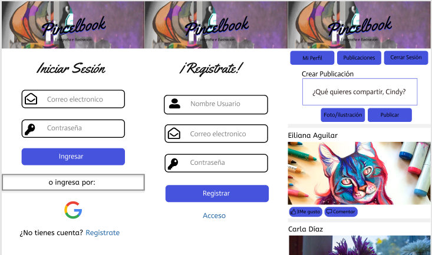

Social Network PINCELBOOK
 _Fotografía e Ilustración_

## Índice

* [1. PINCELBOOK](#1-pincelbook)
* [2. Red social colaborativa](#2-redsocial)
* [3. Construcción del proyecto](#3-construcción)
* [4. Usuarios ](#4-usuarios)
* [5. Diseño y prototipado](#5-diseño)
* [6. Navegación](#6-navegación)

***

## 1. PINCELBOOK :camera: :art:

PINCELBOOK, es una red social colaborativa. Su enfoque artístico, permite que usuarios puedan compartir y conocer obras de aficionados a la fotografía e ilustración.

***

## 2. Red Social Colaborativa :bust_in_silhouette:

Nuestra red social nace de la necesidad de proponer una plataforma sencilla en donde se puede compartir y conocer contenido sobre arte. Resolviendo una problemática que tiene que ver con la instancia o lugar, ya sea físico o virtual donde se puedan exponer obras y conocimientos. Esto debido a que no existen muchos espacios de este tipo, donde se pueda interactuar directamente con otros usuarios, compartir artículos o cualquier información relacionada al tema, además de poder conectar con los creadores de dichas obras.

 Es por lo anterior que **_Pincelbook_** es una red social colaborativa. Existe en pro del crecimiento intelectual y el conocimiento compartido. 

 ***

## 3. Construcción del Proyecto :hammer:

Para la construcción de _Pincelbook_ desarrollamos una breve investigación previa tomando como referencias distintas redes sociales. En base a esto, creamos nuestro diagrama de flujo, planificación e historias de usuario utilizando plataformas como "Trello" "Miro" y "Lucidchart".

[Revisa acá nuestra planificación](https://trello.com/b/QQ004iv7/red-social)

[Revisa acá nuestras historias de usuario](https://miro.com/app/board/o9J_krrQQJE=/)
***

## 4. Usuarios :woman: :boy:

Según la investigación que realizamos y las problemáticas que pretendemos solucionar, nos enfocamos en los siguientes usuarios.

•	Usuarios aficionados al arte.
•	Usuarios aficionados a la ilustración 
•	Usuarios aficionados a la fotografía.
•	Usuarios de redes sociales que quieran acceder a contenido sobre artes.
 
**Objetivos del usuario en relación a la aplicación** :mag:

•	Conectar con otros usuarios sobre un tema en común
•	Compartir de manera simple información con otros usuarios
•	Subir imágenes y publicar contenido

**Datos relevantes que los usuarios han declarado que buscan ver en la interfaz:** :point_left:

•	Una visualidad que llame al usuario a registrarse.
•	Iniciar sesión de manera sencilla y rápida
•	El contenido que se comparte sea claro y efectivo (El usuario busca ver imágenes claras y descriptivas que incluyan un texto)

## 5. Diseño y Prototipado :pencil2: :art:

De acuerdo a la investigación y los datos que recibimos de nuestros usuarios, comenzamos a crear la visualidad de la aplicación.

**Acá nuestro skecth en "Invision"**

A partir de este skecth, recibimos feedback de nuestros usuarios y cliente para comenzar a diseñar nuestro prototipo en Figma.

[Acá puedes revisar nuestro prototipo de alta fidelidad](https://www.figma.com/proto/P4PdHTUiD7ntEu3eHvXd26/PincelBook?node-id=1%3A37&viewport=211%2C169%2C0.1405440717935562&scaling=scale-down-width)

[Acá puedes revisar nuestro prototipo responsive](https://www.figma.com/proto/P4PdHTUiD7ntEu3eHvXd26/PincelBook?node-id=1%3A201&viewport=170%2C296%2C0.22452743351459503&scaling=scale-down)

De acuerdo a este diseño, hicimos entrevistas de usuarios y test de usabilidad. Según el feedback que recibimos, comenzamos a crear nuestra aplicación en código.

**Diseño Final**

Luego de iteraciones de nuestro prototipo y con la aplicación en proceso con usuarios, definimos el siguiente diseño final e interfaz.

(((((ACÁ VA EL DISEÑO FINAL)))))

## 6. Navegación :rowboat:

